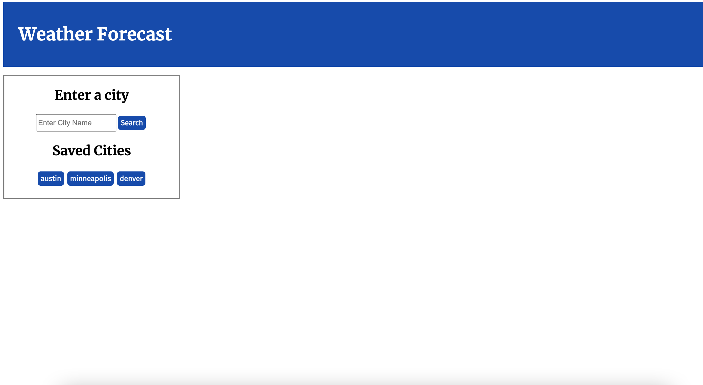
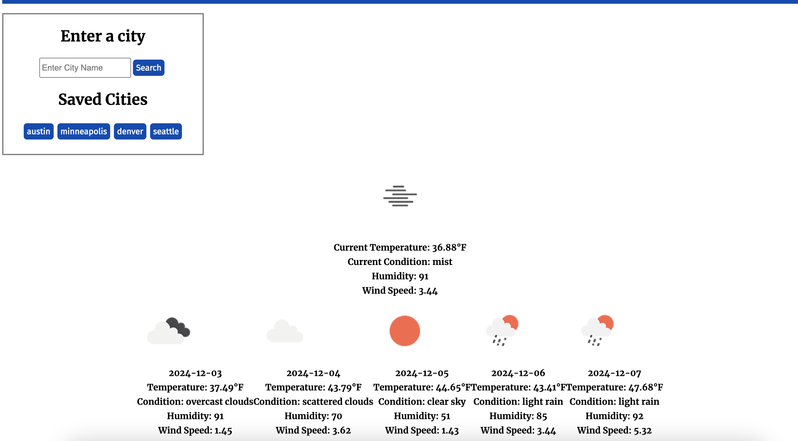

# Weather Dashboard

## Description
This weather forecast project provides users with real-time weather information, including current conditions and a five-day forecast, based on city input. The application utilizes the OpenWeatherMap API to fetch weather data, such as temperature, humidity, wind speed, and weather conditions, including icons that represent the current weather. The front-end is built using HTML, CSS, and JavaScript. HTML structures the webpage, CSS is used for styling and responsive design, and JavaScript handles the logic for fetching weather data and storing user preferences (like saved cities) in local storage. The project also incorporates the use of local storage for saving user-selected cities, allowing easy access to past searches.

## License
MIT

## Screenshots
  

## Links
To view this project, visit [the live link](https://tmcdaniel94.github.io/legendary-palm-tree/)  
To view this project's code, navigate to [this GitHub repository](https://github.com/tmcdaniel94/legendary-palm-tree)  
To view my other projects, head over to [my github](https://github.com/tmcdaniel94)